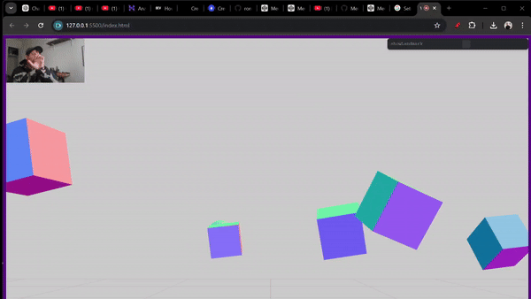

<a id="readme-top"></a>

<!-- PROJECT LOGO -->
<div align="center" style="background-color: #f39c12; color: white; padding: 10px; font-size: 20px; font-weight: bold;">
  WIP
</div>
<br />

<!-- GIF Section -->
<div align="center">
  
</div>

<div align="center">
  <h3 align="center">Three.js Game Studies</h3>
  <p align="center" style="font-weight: bold;">
    Exploring Web-Based Interactive 3D Experiences with Three.js, OpenCV, and Mediapipe
  </p>
</div>

---

## About The Project

This repository explores building interactive 3D web-based tools and games. It combines:

- **Three.js**: For rendering 3D environments.
- **OpenCV** and **Mediapipe**: For real-time hand tracking and gesture recognition.

My focus is on studying camera-based interactive movements and integrating gesture detection with 3D environments to create engaging experiences.

---

## Repository Overview

This repository contains the following projects:

1. **EndlessCubeRunner**:
   - A simple cube runner game using keyboard controls for movement and jumping.
   - Built entirely with **Three.js**.

2. **EndlessCubeRunnerHandC**:
   - An extension of the original **Cube Runner**, integrating **hand-tracking** gestures to control the game.
   - Uses **OpenCV** and **Mediapipe** for detecting hand gestures.

3. **Hand Tracking Script**:
   - A standalone Python script (`handsLandmarksClick.py`) for detecting and tracking hand gestures.


### 1. **Endless Cube Runner**

This is a simple 3D runner game built with **Three.js**. The goal is to avoid enemies and survive for as long as possible.

#### How to Play:

1. Open the **EndlessCubeRunner** folder.
2. Right-click on `index.html` and select **Open with Live Server** (if using Visual Studio Code) or serve it through your preferred local web server.
3. Use the following keyboard controls:
   - **W**: Move forward
   - **S**: Move backward
   - **A**: Move left
   - **D**: Move right
   - **Space**: Jump
4. If you lose, click **Restart Game** or refresh the browser to play again.

---

### 2. **Hand Tracking Interaction (HandC)**

This game (WIP) integrates **OpenCV**, **Mediapipe**, and **Three.js** for gesture-based interactions using your computer's camera. You control the player by moving your hand left or right and jumping by closing your hand.

#### Current Features:

- **Hand Tracking**: Detects and tracks hand gestures in real-time using Mediapipe and OpenCV.
- **Controls**:
  - Move Left/Right: Move your hand left or right in the camera view.
  - Jump: Close your hand to trigger a jump.

#### How to Test:

1. Open the **EndlessCubeRunnerHandC** folder.
2. Right-click on `index.html` and select **Open with Live Server** (if using Visual Studio Code) or serve it through your preferred local web server.
3. Run the `handsLandmarksClick.py` script in your terminal:
   - Ensure your camera is enabled and permissions are granted.
   - Keep your hand in the view of the camera to interact with the game.

---

## Tools and Technologies

- **Three.js**: 3D rendering and animations.
- **OpenCV**: Computer vision and hand detection.
- **Mediapipe**: Real-time gesture recognition.

---

## Future Goals

- Expand **Endless Cube Runner** with more dynamic obstacles and levels.
- Complete the **HandC** game by integrating gesture-based movement and actions fully.
- Add support for mobile devices with touchscreen gestures.

---

## User Instructions for Hand Tracking Script

1. Run the `handsLandmarksClick.py` file in your terminal.
2. Your camera will open up. Place your hand in view of the camera.
3. The system will recognize and track your hand movements:
   - **Index Tip (12)** and **Index Bottom (9)** positions are tracked.
   - If the tip (12) is lower than the bottom (9) in the screen's X,Y coordinates, the system detects a change.
4. To quit the application, press **Q**.

---

<!-- GIF Section -->
<div align="center">
  
</div>
<div align="center">
  
</div>

---

## How to Contribute

Feel free to clone this repository and suggest improvements. Here’s how:

1. Clone the repository:
   ```bash
   git clone https://github.com/your-username/THREEJS-GAMES.git
